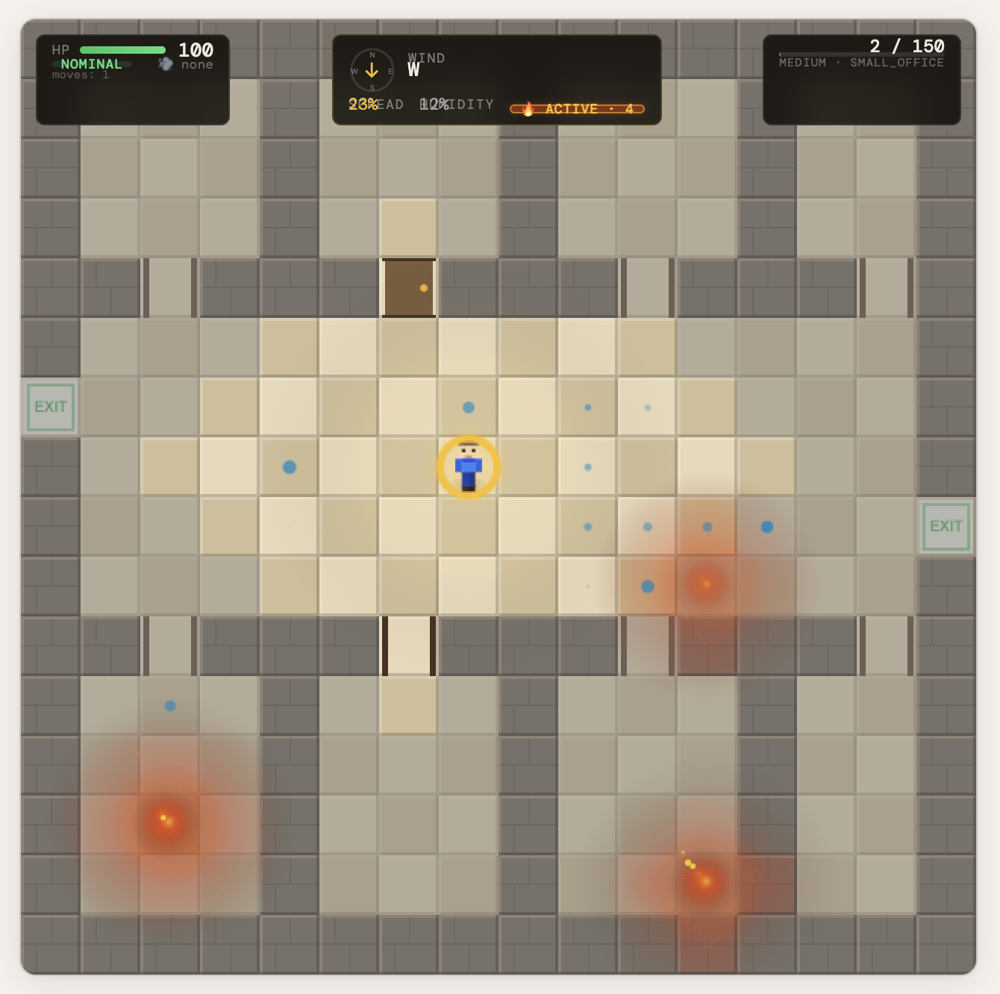
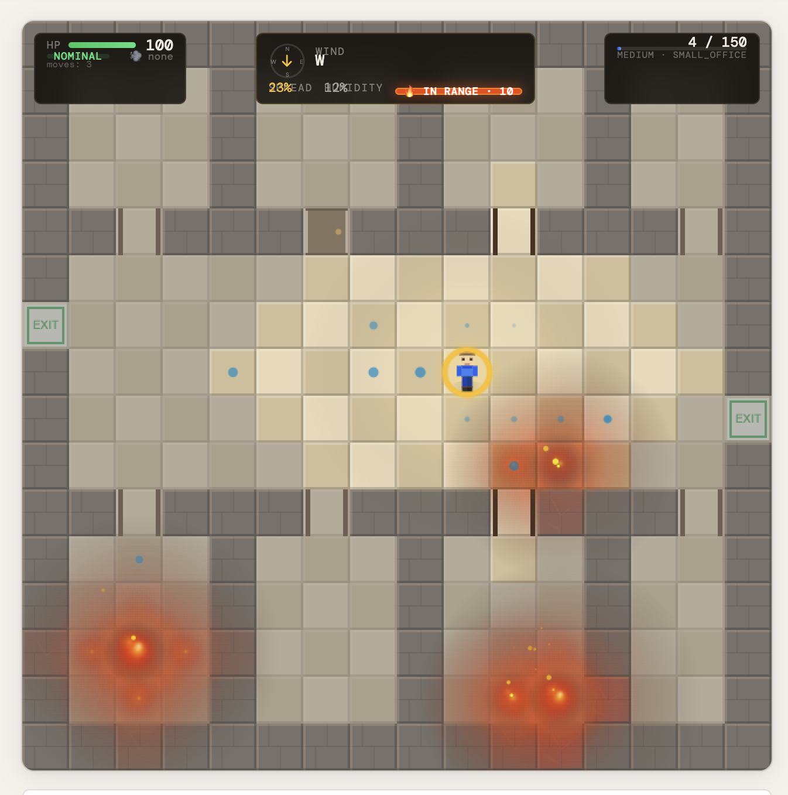
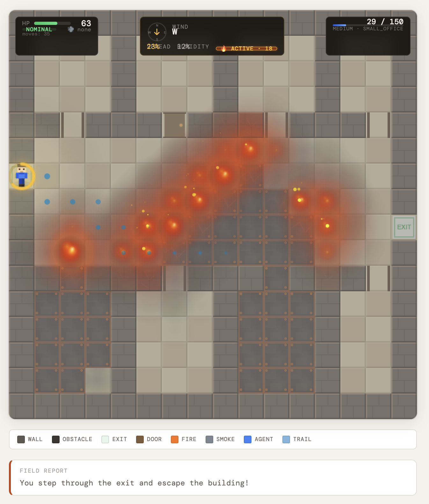

# Pyre: Teaching an AI to Escape a Burning Building

> *"When buildings burn, the difference between a safe evacuation and a tragedy is the quality of decisions made in the first 60 seconds. Can we train an LLM to make them?"*

---

Picture this. You're standing in a corridor. The air is thick.

```
You are in the **main_corridor**. The air is **moderate**.
Health: ████████░░ (82/100) | Wind: EAST
Flames are visible to the **west**.
Exits visible: exit_0_7 — WARNING: 1 exit(s) blocked by fire.
Doors: door_3 (closed) at 2m east.
You hear: Fire alarm sounding; Smoke detector beeping.
Available actions: move(direction='north')  move(direction='south')
                   door(target_id='door_3', door_state='open')  wait()
```

That's not flavor text. That's the exact observation fed to an agent on every step of **Pyre** — our RL training environment where an agent is placed inside a burning building and must decide, turn by turn, what to do next.

The exit is 8 meters west. The fire is also west. The wind is blowing east. The agent has 82 HP. It has seen neither the full floor plan nor any global map. It has only this paragraph — and the memory of the last three paragraphs shown before it.

What should it do?



*Step 2 of 150. HP 100. Wind blowing west. Fire is just starting to smolder in the lower corners — those orange glows will become an inferno within 20 steps. Dark grey cells are unexplored; the agent has no map. Two exits are visible at the left and right walls.*

---

## The Gap This Fills

The RL environment space has plenty of grid worlds and fire simulations. OpenEnv itself ships a `wildfire_env` where an agent suppresses fires from a bird's-eye view with full global state visibility. Useful, well-designed — and completely different from what we built.

Pyre flips the perspective. Instead of fighting fire from above with complete information, the agent is *inside* the building, *surviving* with almost none. This one change in camera angle creates an entirely different problem class:

| | `wildfire_env` | `maze_env` | **Pyre** |
|---|---|---|---|
| Observability | Full | Full | **First-person, text, partial** |
| Map dynamics | Dynamic (fire) | Static | **Dynamic (fire + door state + burnout)** |
| Action role | Suppressor | Navigator | **Survivor** |
| Reward signal | Suppress fire area | Reach goal | **14-component composite** |

The agent isn't trying to win. It's trying to not die. That's a meaningfully different objective — it requires long-horizon planning, world modeling under uncertainty, and on-the-fly risk assessment with a ticking clock. Both LLM agents (reading the text narrative) and RL agents (consuming the structured grid) can train on it without any code changes. Same environment, two completely different agent paradigms.

---

## The World

Pyre's simulation runs on a 16×16 grid (20×24 for hard mode). Every cell is one of six types: floor, wall, door (open or closed), exit, or obstacle — a cell that burned completely and is now rubble. Overlaid on the structural layer are two continuous fields: fire intensity and smoke density, both floats in [0, 1].

### Fire as Physics

The fire simulation is a stochastic cellular automaton. Each step proceeds in three phases.

**Phase 1 — Ignition.** Any cell burning at intensity ≥ 0.3 probabilistically ignites its four cardinal neighbors. The ignition probability is a function of four interacting factors:

- **Wind direction** (9 directions including CALM): downwind cells ignite at **2× base rate**, upwind at **0.5×**. A fire in west wind races east and crawls west.
- **Humidity**: effective spread rate = `p_spread × (1 − humidity)`. At 5% humidity (hard mode), almost nothing stops it.
- **Closed doors**: fire crosses a closed door at **15% of normal rate** — a fact the agent can act on.
- **Per-cell fuel**: office rooms carry a **1.5× fuel multiplier** (paper, wooden furniture). Exit tiles near concrete are at 0.6×.

**Phase 2 — Intensity advance.** Burning cells gain 0.15 intensity per step (fuel-scaled). After **5 steps at full intensity**, a cell burns out and becomes a permanent obstacle. The floor plan changes during the episode — corridors you could walk through at step 5 may be rubble at step 25.

**Phase 3 — Smoke.** Smoke spreads faster than fire, passes weakly through closed doors (40% of open-door rate), and clears per cell based on a **ventilation map**: open halls clear at 0.050/step; enclosed office rooms hold smoke at 0.010/step — five times slower. An agent trapped in a room with a fire on the other side of a closed door will be choked out long before the door gives.



*Step 4. Two steps later and the fire is already brighter — intensity climbing from 0.1 toward 0.3 where spread begins. The HUD shows "IN RANGE · 10": the nearest fire is 10 cells away. The agent's blue trail shows it has moved left. Wind is still blowing west.*

### The Buildings

Three hand-authored 16×16 templates cycle through easy and medium episodes:

- `small_office` — north/south office blocks behind doors, connected by a wide central corridor; exits left and right
- `open_plan` — large open hall with symmetrical 2×2 pillar obstacles; exits at diagonal corners; no internal doors
- `t_corridor` — T-shaped hallway with a vertical stem, horizontal bar, and three exits; side rooms branch off the stem

For **hard mode**, a procedural generator runs a 4-phase algorithm: random non-overlapping room placement, Prim-style MST corridors connecting all room centers via L-shaped tunnels, exit tunneling to both outer walls, then zone labeling and fuel/ventilation derivation. A BFS connectivity guard verifies at least one exit is reachable from the agent's spawn before accepting the layout. Hard-mode episodes are 20×24 grids the agent has never seen before.

### What the Agent Can See

Visibility is a BFS flood-fill from the agent's position, blocked by walls. The radius starts at 5 cells. In moderate smoke, it drops to 3. In heavy smoke, it drops to 2.

An agent standing in heavy smoke in a corner office might see exactly 4 cells. From those 4 cells, it has to decide whether to open the door in front of it or back away. This is the environment making the problem hard in an honest way — the agent is blind because smoke is thick, not because we arbitrarily withheld state.


*Step 21. Burnout in action: those dark cracked cells in the center-right are former floor tiles that burned for 5 full steps and became permanent obstacles. The corridor is now partially blocked. HP 63 — the agent took some smoke damage. The exit on the left is still reachable, but the right exit is being cut off.*

---

## The Reward Signal

A reward function that teaches is the hardest part of environment design. Give too little signal and nothing is learned. Give too much and the agent games it. Design it wrong and the agent discovers behaviors you didn't intend.

Pyre composes **14 rubric components** — each a Python class with a `.score()` method that the environment calls every step:

**Per step:**

| Rubric | Value | Teaches |
|---|---|---|
| `TimeStepPenalty` | −0.01 | Urgency. Every step costs. |
| `ProgressReward` | +0.25 | Moved closer to nearest unblocked exit (BFS, not Manhattan) |
| `ProgressRegressionPenalty` | −0.15 | Moved farther from exit — asymmetric two-sided gradient |
| `SafeProgressBonus` | +0.05 | Progress through a smoke-free cell — prefer clean routes |
| `DangerPenalty` | −0.50 | Moved into smoke ≥ moderate or fire-adjacent cell |
| `HealthDrainPenalty` | −0.02 × dmg | Proportional to HP lost this step |
| `StrategicDoorBonus` | +0.50 | Closed a door adjacent to active fire (once per door per episode) |
| `ExplorationBonus` | +0.02 | First visit to any cell — prevents corner-hugging loops |

**Episode end:**

| Rubric | Value | Teaches |
|---|---|---|
| `SelfSurviveBonus` | +5.0 | Evacuated alive |
| `HealthSurvivalBonus` | +1.5 × (hp/100) | Evacuate with *more* health — prefer safe routes |
| `SelfDeathPenalty` | −10.0 | Died |
| `TimeoutPenalty` | −5.0 to −8.0 | Ran out of steps — scales with remaining health |
| `NearMissBonus` | 0 to +3.0 | Partial credit on death based on closest exit approach |
| `TimeBonus` | +0.05 × remaining_steps | Escape fast |

Three of these deserve closer attention.

**`NearMissBonus`** exists to prevent reward collapse on hard difficulty. When early training produces agents that die every episode, a flat −10 on all deaths gives zero gradient — every failure looks identical, the optimizer has nothing to differentiate. `NearMissBonus` uses the minimum BFS distance ever reached during the episode: `max(0, 3.0 − 0.5 × min_exit_dist)`. Dying 1 cell from an exit earns +2.5. Dying 12 cells away earns nothing. This single rubric is often the difference between hard-mode training converging and oscillating indefinitely.

**`StrategicDoorBonus`** is an emergent-tactics incentive. The agent is never told that closing a door slows fire. It discovers this through reward — the action produces +0.50, and over many episodes that reward correlates with longer survival. The anti-gaming guard (a `rewarded_doors` set; each door earns the bonus at most once per episode) prevents the obvious exploit of opening and re-closing the same door.

**`TimeoutPenalty`** scaling is deliberate: at 100 HP it's −8.0, at 50 HP it's −6.5, at 10 HP it's −5.3. A healthy agent that timed out had no excuse — exits were reachable and it didn't take them. An agent barely alive at timeout was fighting hard. The signal should be different.

---

## Training with PPO

The agent's observation is encoded into a **23,128-dimensional float32 vector**. The grid portion is a 24×24 padded map (sized for hard mode) with 10 channels: 6 one-hot cell type, fire intensity, smoke density, visibility mask, and agent position mask. The scalar portion is 17 features: health, step progress, fire parameters, agent coordinates, exit distance and count, visible cell count, smoke severity, alive/evacuated flags, and three **exit compass features** — signed (dx, dy) direction toward the nearest exit cell and normalized Manhattan distance.

The exit compass was added after observing that agents trained on fixed layouts completely failed on procedurally generated hard-mode maps — they were navigating by memorized topology. The compass gives the policy a map-agnostic spatial anchor: a unit vector pointing from the agent to the nearest exit, recomputed from the live grid every step.

**Four of these frames are stacked.** Fire has direction — a cell that was clear two steps ago and is heavy smoke now tells the agent exactly where fire is moving. Frame stacking makes temporal dynamics explicit without requiring recurrent architecture.

**The action space is 41 discrete actions**: 4 move, 4 look, 1 wait, 16 door-open, 16 door-close. Each step's `available_actions_hint` list is converted into a binary validity mask applied as −∞ to policy logits before softmax — invalid moves are architecturally excluded, not penalized. Look actions are masked out during RL training entirely: the agent already receives the full grid; spending a step to look costs a turn and earns no reward.

The **ActorCritic** network uses a shared `LayerNorm → FC(512) → LayerNorm → ReLU → FC(256) → LayerNorm → ReLU → FC(128) → ReLU` backbone before splitting into policy and value heads. LayerNorm before activations handles the large flat input without requiring explicit normalization. Orthogonal initialization prevents saturated softmax from the first training step.

**Curriculum learning is patience-gated.** The agent starts on `easy` and advances to `medium` only after achieving ≥65% evacuation rate over a 30-episode window, sustained for 15 episodes. The same gate holds at `medium → hard`. During the hard phase, 25% of episodes replay on medium to prevent catastrophic forgetting.

Four additional reward shapings stack on top of the environment's signal: idle penalty (−0.05/wait), fire proximity warning (−0.15 when landing adjacent to fire), anti-loop penalty (−0.20 for revisiting a cell within the last 12 steps), and exit proximity pull — a continuous gradient toward exits that fires even before BFS progress kicks in.

---

## Results



*Step 29 of 150. HP 63. The entire building is ablaze — 18 active fire cells, multiple rooms fully burned out. And yet the agent is at the exit. Field Report: "You step through the exit and escape the building." This is what a successful episode looks like: reaching safety before the fire made it impossible.*

The trained PPO agent ([Krooz/pyre-ppo-agent](https://huggingface.co/Krooz/pyre-ppo-agent)) shows clear progression from the random baseline. The random agent — 70% hint-biased random actions, 30% fully random — produces negative cumulative rewards on medium difficulty in nearly every episode. It has no evacuation strategy, no fire avoidance, no concept of door mechanics.


*200 episodes, patience-gated curriculum. The agent starts from random behavior (reward ≈ −15) and climbs to ~+15 average reward within 30 episodes on easy. The sharp dip at episode ~100 is the curriculum advancing to medium difficulty — harder fire, more sources, any wind direction. By episode 200 the agent has recovered to a **75% evacuation success rate** on medium. Blue diamonds are deterministic evaluation runs; they hit near-100% on easy before the transition.*

The PPO agent learns across three measurable dimensions visible in the training curves:

1. **Evacuation rate climbs from ~0% to 75%** on medium difficulty in 200 episodes. The patience gate held on easy until the 30-episode success rate sustained above 65%, confirming mastery before escalation.
2. **The dip is diagnostic, not failure.** The success rate drop from ~90% to ~60% exactly at the easy→medium boundary is the curriculum working as designed — the agent encountering new wind conditions and denser fire for the first time.
3. **Health-on-exit improves** over training — the `HealthSurvivalBonus` gradient is working; later evacuations happen at higher HP than early ones, indicating the agent is finding cleaner, smoke-free routes rather than just any path out.

Full training metrics, reward curves, and model weights are on the [Hugging Face model card](https://huggingface.co/Krooz/pyre-ppo-agent). The Colab notebook for end-to-end replication runs directly against the live HuggingFace Space.

---

## Try It Yourself

Pyre is deployed as a live HuggingFace Space at [krooz-pyre-env.hf.space](https://krooz-pyre-env.hf.space). The full interactive dashboard — tactical controls, door registry, agent biometrics, and a per-step event log — is available without any setup.


*The Pyre HuggingFace Space at step 30. Right panel: Proximity Doors shows door_2 is still closed, while door_5 and door_7 have failed (burned to obstacles). Agent Biometrics shows HP 63%, position (0,6), System Integrity at 63%. Environment: 19 hazard cells, wind W, 12% humidity. The event log shows 51 steps of decisions and their rewards.*

Run it locally in two commands:

```bash
cd pyre_env && uv sync && uv run server
```

```bash
python examples/random_agent.py --episodes 5 --verbose
```

Or talk to it directly over HTTP:

```bash
# Start a new episode
curl -X POST http://localhost:8000/reset \
  -H "Content-Type: application/json" -d '{"difficulty": "medium"}'

# Take a step
curl -X POST http://localhost:8000/step \
  -H "Content-Type: application/json" -d '{"action": "move", "direction": "north"}'
```

Or use the Python client:

```python
from pyre_env import PyreEnv, PyreAction

with PyreEnv(base_url="http://localhost:8000") as env:
    obs = env.reset()
    print(obs.observation.narrative)
    result = env.step(PyreAction(action="move", direction="north"))
    print(f"Reward: {result.reward:.3f} | HP: {result.observation.agent_health}")
```

Train from scratch in Colab: [Pyre PPO Training Notebook](https://colab.research.google.com/drive/1ojC55qKXMVRXdjKeG5dUHiA5RBOBxA9V?usp=sharing)

---

## What's Next

Pyre is a foundation, not a finished product. The architecture — cellular automaton physics, composable rubrics, narrative observation layer, dual LLM+RL interface — generalises well beyond a burning building.

**Other natural disasters.** The fire sim can be replaced or extended with alternative physics. A flood environment would use water pressure and rising levels instead of fire intensity. An earthquake scenario would collapse walls procedurally, introducing impassable rubble in real time. A chemical spill would add wind-borne toxin spread with a different health decay model. The `fuel_map` / `ventilation_map` / `rubric` architecture is the same in all cases — only the physical model changes.

**NPC characters.** The environment already has NPC spawn points and a door registry for inter-agent coordination. The natural next step is adding civilians who move, panic, block corridors, and need rescuing. A survivor agent earns bonus reward for reaching exits alongside NPCs. This introduces the theory-of-mind dimension: the agent must model other agents' paths and prioritise accordingly.

**3D maps.** The 16×16 grid is a deliberate simplification for training stability and HTTP throughput. A 3D extension would add floor levels connected by stairs, with fire spreading both horizontally and vertically. The observation layer would shift from a 2D BFS to a 3D cone-of-vision, and the narrative would need to convey vertical cues ("smoke rising from the floor below"). The PPO encoder would pad to a fixed 3D volume.

**Multi-floor procedural generation.** The existing Prim-MST generator already produces novel layouts every hard-mode episode. Stacking multiple floors with staircase connections would make every episode a genuinely unique building — relevant to real-world emergency response planning where no two structures are alike.

**LLM fine-tuning.** The text narrative interface was built for LLM agents from day one. The next training phase is GRPO fine-tuning (infrastructure already in `training/`) where the language model's policy is updated directly on Pyre episode rollouts, rather than a separate RL network trained on the structured grid.

---

Pyre isn't a toy. It's a physics-driven environment where every step costs health, every door is a tactical decision, and every exit might be on fire by the time the agent gets there. The agent doesn't get a map. It gets a first-person text paragraph, a structured grid, and 41 possible moves. And somewhere inside a 23,128-dimensional observation vector, a trained PPO policy has learned enough about burning buildings to find the exit — most of the time.

That seems like a hard problem to solve. It is. That's the point.

---

*🔥 Space: [krooz-pyre-env.hf.space](https://krooz-pyre-env.hf.space) · Model: [Krooz/pyre-ppo-agent](https://huggingface.co/Krooz/pyre-ppo-agent) · Training: [Colab Notebook](https://colab.research.google.com/drive/1ojC55qKXMVRXdjKeG5dUHiA5RBOBxA9V?usp=sharing)*
