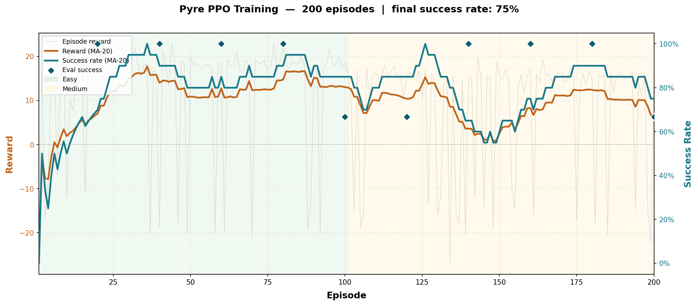

# Pyre — Crisis Navigation Environment for LLM Agents

> *When buildings burn, the difference between a safe evacuation and a tragedy is the quality of decisions made in the first 60 seconds. Can we train an LLM to make them?*

**Pyre** places an LLM agent *inside* a burning building. The agent must navigate to safety under partial observability — no global map, a real health system, hard time pressure, and a fire that actively spreads, blocks exits, and permanently alters the floor plan.

**Links:**
🔥 [Live Space](https://krooz-pyre-env.hf.space) &nbsp;|&nbsp;
🤖 [Trained Model](https://huggingface.co/Krooz/pyre-ppo-agent) &nbsp;|&nbsp;
📓 [Colab Training](https://colab.research.google.com/drive/1ojC55qKXMVRXdjKeG5dUHiA5RBOBxA9V?usp=sharing) &nbsp;|&nbsp;
📝 [Blog](BLOG.md)

---

## Why Pyre vs. existing environments

| Feature | `grid_world` | `maze_env` | `wildfire_env` | **Pyre** |
|---|---|---|---|---|
| Observability | Full | Full | Partial | **Partial, first-person, text** |
| Map dynamics | Static | Static | Dynamic (fire) | **Dynamic (fire + doors + burnout)** |
| Action richness | 4 moves | 4 moves | Suppression | **Movement + door control + look** |
| Agent role | Mover | Mover | Suppressor | **Survivor** |
| Reward complexity | Reach goal | Reach goal | Suppress fire | **14-component composite rubric** |

*`wildfire_env` trains an agent to fight fires from above; Pyre trains an agent to survive from inside.*

---

## Quick start

```bash
uv sync
uv run server           # → http://localhost:8000

# Health check
curl http://localhost:8000/health

# Start episode
curl -X POST http://localhost:8000/reset \
  -H "Content-Type: application/json" \
  -d '{"difficulty": "medium"}'

# Take a step
curl -X POST http://localhost:8000/step \
  -H "Content-Type: application/json" \
  -d '{"action": "move", "direction": "north"}'

# Random baseline (smoke test)
python examples/random_agent.py --episodes 5 --verbose
```

### Python client

```python
from pyre_env import PyreEnv, PyreAction

with PyreEnv(base_url="http://localhost:8000") as env:
    result = env.reset()
    print(result.observation.narrative)
    result = env.step(PyreAction(action="move", direction="north"))
    print(f"Reward: {result.reward:.3f} | HP: {result.observation.agent_health}")
```

### Environment variables

| Variable | Default | Description |
|---|---|---|
| `PORT` | `8000` | HTTP server port |
| `PYRE_MAX_STEPS` | `150` | Default max steps per episode (overridden by difficulty preset) |
| `PYRE_SEED` | `42` | Base RNG seed; each episode increments by 37 |
| `HF_TOKEN` | — | Required only for `training/push_to_hub.py` |

---

## Architecture

```
reset() / step()
    │
    ▼
PyreEnvironment          server/pyre_env_environment.py
    ├── floor_plan.py    Building template or procedural generation
    ├── fire_sim.py      Cellular automaton: spread → intensity → smoke
    ├── narrative.py     BFS visibility → first-person text + structured fields
    └── rubrics.py       14 composable reward components
    │
    ▼
PyreObservation          models.py
    ├── narrative        str  — primary LLM input
    ├── map_state        PyreMapState — full grid snapshot for RL encoders
    ├── reward           float
    ├── done             bool
    └── metadata         dict — fire params, distances, difficulty
```

### Data flow per step

1. `_execute_action()` — move / door / look / wait, returns feedback string
2. Check evacuation — agent on EXIT cell with `fire < 0.5` → success
3. `FireSim.step()` — advance fire, smoke, burn timers; may convert cells to OBSTACLE
4. Apply health damage from smoke (0.5–5 HP/step) and fire (10 HP/step)
5. `_compute_reward()` — call all 14 rubrics with shared kwargs
6. `build_narrative_observation()` — BFS visibility, compose text, collect action hints
7. `_build_map_state()` — assemble full grid snapshot for UI / RL encoder
8. Return `PyreObservation`

---

## Project structure

```
pyre_env/
├── models.py                        PyreAction, PyreObservation, PyreMapState, PyreState
├── client.py                        PyreEnv (EnvClient subclass, narrative-focused)
├── openenv.yaml                     OpenEnv manifest (space, fastapi, port 8000)
├── pyproject.toml
│
├── server/
│   ├── app.py                       FastAPI bootstrap; stateful /reset, /step, /state, /scene
│   ├── pyre_env_environment.py      PyreEnvironment state machine + difficulty presets
│   ├── floor_plan.py                3 hand-authored templates + procedural generator
│   ├── fire_sim.py                  Cellular automaton fire/smoke simulation
│   ├── narrative.py                 BFS visibility + first-person text renderer
│   └── rubrics.py                   14 composable reward rubric classes
│
├── frontend/
│   ├── src/
│   │   ├── App.tsx                  Dashboard shell: topbar, canvas zone, side panel
│   │   ├── components/Map2D.tsx     Canvas2D renderer: fire, smoke, fog-of-war, agent
│   │   ├── components/HUD.tsx       HP bar, wind compass, step counter overlay
│   │   ├── components/ControlPanel.tsx  Move/door controls, difficulty, auto-wait
│   │   └── components/StatusCard.tsx   Agent biometrics, environment stats
│   └── README.md                    Frontend setup and demo script
│
├── training/
│   ├── ppo/
│   │   ├── train_torch_ppo.py       In-process PPO (imports PyreEnvironment directly)
│   │   ├── train_torch_ppo_http.py  HTTP-based PPO (trains against live server)
│   │   └── pyre_ppo_training.ipynb  Colab notebook (self-contained, talks to HF Space)
│   └── push_to_hub.py               Upload checkpoint + metrics to HuggingFace Hub
│
├── examples/
│   └── random_agent.py              Baseline: 70% hint-biased, 30% random
│
└── artifacts/                       Training outputs: .pt, .csv, .png
```

---

## Simulation layer

### Fire simulation (`server/fire_sim.py`)

A stochastic cellular automaton over a flat row-major grid. Each call to `FireSim.step()` runs three phases:

**Phase 1 — Ignition.** Any cell with `fire ≥ FIRE_BURNING (0.3)` tries to ignite each cardinal neighbor:

```
p_ignite = p_spread × (1 − humidity) × wind_multiplier × fuel_map[neighbor]
```

- **Wind multiplier**: dot product of spread direction with wind vector → downwind 2×, upwind 0.5×, crosswind 1×
- **Closed doors**: `DOOR_CLOSED_FIRE_FACTOR = 0.15` (fire crosses at 15% normal rate)
- **Fuel map**: per-cell float from `floor_plan.py`; office rooms 1.5×, exits 0.6×

**Phase 2 — Intensity.** Existing fire gains `FIRE_INTENSITY_GAIN (0.15) × fuel_map[i]` per step. When `burn_timer ≥ BURNOUT_TICKS (5)` and intensity reaches 1.0, the cell becomes `OBSTACLE` — permanently impassable rubble.

**Phase 3 — Smoke.** Smoke is sourced at +0.3/step for cells with `fire ≥ 0.3`, diffuses between neighbors at `SMOKE_SPREAD_RATE (0.20)`, passes through closed doors at 40% rate, and decays per cell according to `ventilation_map`.

**Key constants:**

| Constant | Value | Role |
|---|---|---|
| `FIRE_IGNITION` | 0.1 | Starting intensity for new ignitions |
| `FIRE_BURNING` | 0.3 | Threshold for spreading and causing damage |
| `FIRE_INTENSITY_GAIN` | 0.15 | Intensity added per step to burning cell |
| `BURNOUT_TICKS` | 5 | Steps at full intensity before cell → OBSTACLE |
| `DOOR_CLOSED_FIRE_FACTOR` | 0.15 | Fire spread multiplier through closed doors |
| `SMOKE_SPREAD_RATE` | 0.20 | Smoke diffusion rate between neighbors |
| `SMOKE_DOOR_FACTOR` | 0.40 | Smoke rate through closed doors |
| `EXIT_BLOCKED_FIRE_THRESHOLD` | 0.5 | Fire intensity at which an exit is considered blocked |

### Building templates (`server/floor_plan.py`)

Three hand-authored 16×16 templates for easy and medium difficulty:

| Template | Layout | Exits | Doors | Notes |
|---|---|---|---|---|
| `small_office` | Two corridor bands + office rooms N/S | 2 (W, E walls) | 8 (room↔corridor) | Agent spawns in corridor |
| `open_plan` | Open hall with 4 × 2×2 pillar obstacles | 2 (diagonal corners) | 0 | High ventilation throughout |
| `t_corridor` | T-shaped: vertical stem + horizontal bar | 3 (top, left, right) | 4 (rooms off stem) | Multiple route decisions |

Each template carries a `zone_map` (cell → zone label), derived `fuel_map`, and `ventilation_map`:

| Zone | Fuel multiplier | Smoke decay/step | Notes |
|---|---|---|---|
| `north/south_offices` | 1.5× | 0.010 | High fuel, poor ventilation |
| `west/east_rooms` | 1.5× | 0.010 | Same as offices |
| `main_corridor` | 1.0× | 0.028 | Baseline |
| `northwest/northeast/etc. hall` | 0.9× | 0.050 | Open plan — best ventilation |
| `exit` | 0.6× | 0.040 | Concrete, vented |

**Hard mode — procedural generation.** Episodes run on a freshly generated 20×24 floor plan every time:

1. **Room placement**: random non-overlapping rectangles (3–5 × 3–4 cells, 6–10 rooms)
2. **MST corridors**: Prim-style minimum spanning tree connecting room centers via L-shaped tunnels
3. **Exit placement**: deterministic tunnels from leftmost/rightmost floor cells to outer walls
4. **Connectivity guard**: BFS from agent spawn verifies ≥1 exit is reachable; up to 3 attempts; falls back to `small_office`

### Visibility (`server/narrative.py`)

BFS flood-fill from agent position, walls block expansion:

| Agent smoke level | Visibility radius |
|---|---|
| None / light (`< 0.5`) | 5 cells |
| Moderate (`0.5–0.8`) | 3 cells |
| Heavy (`≥ 0.8`) | 2 cells |

---

## What the agent sees

Every step, `narrative.py` assembles a first-person text observation from raw grid state:

```
You are in the **main_corridor**. The air is **moderate**.
Health: ████████░░ (85/100) | Wind: **EAST**
Flames are visible to the **west**.
Exits visible: exit_0_7 at 8m west.
Doors: door_1 (closed) at 2m east.
You hear: Fire alarm sounding; Smoke detector beeping.
Last action: You move south. The smoke is thick here.
Available actions: move(direction='north')  move(direction='south')
                   door(target_id='door_1', door_state='open')  look(direction='east')  wait()
```

The same state is also exposed as structured fields in `PyreObservation` (smoke level, fire direction, visible objects, blocked exits, action hints) and as a full grid snapshot in `PyreObservation.map_state` for programmatic / RL use.

---

## Action space

| Action | Parameters | Effect |
|---|---|---|
| `move` | `direction: north\|south\|east\|west` | Move one cell; blocked by walls, obstacles, closed doors |
| `door` | `target_id: str`, `door_state: open\|close` | Open or close a door within 2 cells Manhattan distance |
| `look` | `direction: north\|south\|east\|west` | Ray-scan up to 5 cells; returns per-cell smoke/fire/zone/door/exit detail. Time still advances. |
| `wait` | — | Skip turn |

---

## Reward function — all 14 components

### Per-step rubrics

| Class | Value | Condition |
|---|---|---|
| `TimeStepPenalty` | −0.01 | Every step |
| `ProgressReward` | +0.25 | `move` reduced BFS distance to nearest unblocked exit |
| `ProgressRegressionPenalty` | −0.15 | `move` increased BFS distance to nearest exit |
| `SafeProgressBonus` | +0.05 | Progress AND new cell has `smoke < 0.5` |
| `DangerPenalty` | −0.50 | `move` into cell with `smoke ≥ 0.5` OR adjacent to `fire ≥ 0.3` |
| `HealthDrainPenalty` | −0.02 × dmg | Proportional to HP lost this step |
| `StrategicDoorBonus` | +0.50 | Closed a door with a cardinal neighbor `fire ≥ 0.3`; once per door per episode |
| `ExplorationBonus` | +0.02 | `move` to a cell not visited this episode |

### Episode-end rubrics (fire only when `done=True`)

| Class | Value | Condition |
|---|---|---|
| `SelfSurviveBonus` | +5.0 | Agent evacuated alive |
| `HealthSurvivalBonus` | +1.5 × (hp/100) | Agent evacuated (range 0 → +1.5) |
| `SelfDeathPenalty` | −10.0 | Agent died (HP ≤ 0) |
| `TimeoutPenalty` | −5.0 to −8.0 | Alive but out of steps; scaled by `−5 − 3×(hp/100)` when exits were reachable |
| `NearMissBonus` | max(0, 3.0 − 0.5 × min_dist) | On death only; partial credit for close exit approach |
| `TimeBonus` | +0.05 × remaining_steps | Agent evacuated |

**BFS note:** `ProgressReward`, `ProgressRegressionPenalty`, `SafeProgressBonus`, and `NearMissBonus` all use true BFS traversal distance (walls and obstacles block; closed doors are treated as passable so the reward models optimal reachability assuming doors can be opened). Manhattan distance is never used for rewards.

---

## Difficulty presets

| Level | Sources | Spread rate | Humidity | Wind | Max steps | Map |
|---|---|---|---|---|---|---|
| `easy` | 1 | 10–20% | 30–50% | CALM only | 200 | Fixed 16×16 templates |
| `medium` | 2–4 | 15–40% | 10–45% | Any | 150 | Fixed 16×16 templates |
| `hard` | 3–5 | 30–55% | 5–20% | Never CALM | 100 | Procedural 20×24 |

**Health damage rates** (applied after fire sim step):

| Condition | HP/step |
|---|---|
| Light smoke (`0.2–0.5`) | 0.5 |
| Moderate smoke (`0.5–0.8`) | 2.0 |
| Heavy smoke (`≥ 0.8`) | 5.0 |
| On fire (`fire ≥ 0.3`) | 10.0 |

Smoke and fire damage stack if both conditions apply.

---

## HTTP API

The FastAPI server exposes both the standard OpenEnv routes and additional endpoints:

| Method | Path | Body | Returns |
|---|---|---|---|
| `GET` | `/health` | — | `{"status": "ok"}` |
| `POST` | `/reset` | `{"difficulty": "medium", "seed": null}` | `{observation, reward, done, metadata}` |
| `POST` | `/step` | `{"action": "move", "direction": "north"}` | `{observation, reward, done, metadata}` |
| `GET` | `/state` | — | Full `PyreState` dump |
| `GET` | `/scene` | — | Structured scene graph for UI renderers |
| `GET` | `/` | — | Frontend `index.html` |

`/scene` returns a 5-channel per-cell tensor (`cell_type`, `fire`, `smoke`, `is_agent`, `is_visible`) plus structured `labels` (agent position/health/location, episode params, door registry) — consumed by the React frontend.

---

## Training

Three training surfaces share the same PPO algorithm core from `train_torch_ppo.py`:

### 1. In-process (fastest)

```bash
python training/ppo/train_torch_ppo.py \
  --episodes 500 \
  --device cuda \
  --difficulty-schedule easy,medium,hard \
  --patience-threshold 0.65 \
  --output artifacts/pyre_ppo.pt
```

### 2. HTTP (against live server)

```bash
# Start server first
uv run server

python training/ppo/train_torch_ppo_http.py \
  --url http://localhost:8000 \
  --episodes 300
```

### 3. Colab notebook (against HF Space)

Open [`training/ppo/pyre_ppo_training.ipynb`](training/ppo/pyre_ppo_training.ipynb) or the [hosted Colab](https://colab.research.google.com/drive/1ojC55qKXMVRXdjKeG5dUHiA5RBOBxA9V?usp=sharing). The notebook points `SERVER_URL` at `https://krooz-pyre-env.hf.space` and trains entirely over HTTP.

### Observation encoding

The `ObservationEncoder` in `train_torch_ppo.py` encodes each `PyreObservation` into a **5,785-dim float32 vector**:

```
Grid:    24×24 × 10 channels = 5,760
         • 6 one-hot cell type (floor/wall/door_open/door_closed/exit/obstacle)
         • fire intensity [0,1]
         • smoke density  [0,1]
         • visibility mask (1=visible)
         • agent position mask

Scalars: 17 global features
         health, step_progress, fire_spread_rate, humidity,
         agent_x_norm, agent_y_norm, nearest_exit_distance,
         reachable_exit_count, visible_cell_count, fire_sources,
         smoke_severity, alive, evacuated,
         exit_dx_norm, exit_dy_norm, exit_manhattan_norm   ← exit compass (Fix 3)

One-hots: wind (5) + difficulty (3) = 8

Total: 5,760 + 17 = 5,777 + 8 = 5,785
```

With `--history-length 4` (default), four frames are stacked: **input_dim = 23,140**.

### Network architecture

```
Input (23,140)
  → LayerNorm → FC(512) → LayerNorm → ReLU
  → FC(256)   → LayerNorm → ReLU
  → FC(128)   → ReLU
       ├── Policy head → FC(41) logits + action mask (−∞ for invalid)
       └── Value head  → FC(1) scalar
```

Orthogonal init (√2 gain hidden layers, 0.01 policy head). Total parameters: ~12.3M.

### Curriculum

The `PatienceCurriculum` gating:

```
Stay on current difficulty until:
  success_rate (last 30 eps) ≥ patience_threshold (default 0.65)
  for patience_window (default 15) consecutive episodes
→ then advance to next difficulty

Hard phase: 25% of episodes replay on medium (--hard-mix-ratio 0.25)
            to prevent catastrophic forgetting
```

### Push to HuggingFace Hub

```bash
export HF_TOKEN=hf_...
uv run python training/push_to_hub.py \
  --repo-id Krooz/pyre-ppo-agent \
  --stem pyre_ppo_fixed \
  --artifacts-dir artifacts
```

Uploads `{stem}.pt`, `{stem}.csv`, `{stem}.png`, `{stem}_eval.csv`, and generates a model card README. Trained weights: **[Krooz/pyre-ppo-agent](https://huggingface.co/Krooz/pyre-ppo-agent)**.

### Training results



**200 episodes, patience-gated easy→medium curriculum.**

| Phase | Episodes | Final success rate | Notes |
|---|---|---|---|
| Easy | ~1–100 | ~90% | Reward climbs from −15 to +15 within 30 eps |
| Medium | ~100–200 | **75%** | Dip at transition, recovers within 25 eps |

Key observations from the curves:
- Raw episode reward (grey) is noisy due to stochastic fire; MA-20 (orange) shows clean monotone improvement within each phase
- The success rate drop at episode ~100 is the curriculum gating working correctly — medium difficulty introduces wind, denser fire, and shorter time limits simultaneously
- Evaluation checkpoints (blue diamonds) confirm near-100% on easy before the gate advances
- Final 75% success rate on medium vs ~3% for the random baseline

---

## Frontend

A cinematic real-time visualization built in React 19 + Vite + TypeScript.

```bash
cd frontend
npm install
npm run dev     # → http://localhost:5173
```

The map renderer (`src/components/Map2D.tsx`) uses HTML5 Canvas 2D with:
- **5-layer volumetric fire**: dark-red base → orange body → yellow core → white-hot tip → wind-bent plume
- **Ember particle system**: 200-max particles, wind-biased velocity, fade-out
- **Animated walls**: brick texture with heat-tint shift and crack lines near fire
- **Charred obstacles**: dark rubble cells with ember-glow when adjacent to fire
- **Fog-of-war**: per-cell alpha overlay; fire beacon glow punches through fog
- **Minecraft-style agent**: pixel-art character with health-based color theme (blue→orange→red→purple), gold health arc ring, and movement trail

The agent color changes with HP: `healthy (≥60%) → blue`, `moderate (30–59%) → orange`, `low (1–29%) → red`, `critical (≤0%) → purple`.

The right side panel polls `/scene` every 500ms and shows tactical controls, per-door state (open/closed/failed), agent biometrics, environment stats, event log with reward annotations, and raw network activity.

---

## Deployment

```bash
openenv push --repo-id your-org/pyre-env
```

The `openenv.yaml` manifest declares this as a FastAPI space on port 8000. Docker configuration is in `server/Dockerfile`.

---

## Roadmap

The current architecture — cellular automaton physics, composable rubrics, BFS-based visibility, narrative observation layer, dual LLM+RL interface — is designed to generalise. Planned extensions:

### Other natural disasters
The `FireSim` is one implementation of a physics layer. The same environment shell supports alternative calamity models with minimal changes:

| Disaster | Physics swap | New mechanic |
|---|---|---|
| **Flood** | Water pressure + rising level grid | Agent must find high ground or exits before water fills corridors |
| **Earthquake** | Probabilistic wall collapse | Rubble blocks form during episode; structural integrity per cell |
| **Chemical spill** | Wind-borne toxin concentration | Invisible hazard; agent must infer spread direction from health decay |
| **Wildfire (ground level)** | Existing fire sim, outdoor map | No walls, wind-dominated spread, sparse exits |

Each shares the same reward rubric composability, observation layer, and training stack.

### NPC characters
The floor plan templates already define `spawn_zones` and the state model has placeholders for multi-agent positions. Next steps:
- Add panicking civilians who move randomly and block corridors
- Rescue mechanic: escort NPCs to exits for bonus reward
- Theory-of-mind challenge: agent must model NPC movement to plan around them
- Competing agent: second RL agent racing for the same exit (mixed cooperative/competitive)

### 3D maps and multi-floor buildings
- Stack floor levels connected by staircases
- Fire spreads both horizontally and vertically through floor openings
- 3D BFS cone-of-vision observation (currently 2D flood-fill)
- Elevator shafts as high-risk shortcuts
- Procedural multi-floor generator extending the existing Prim-MST approach

### LLM fine-tuning (GRPO)
- `training/` already scaffolds GRPO infrastructure alongside PPO
- Fine-tune a language model's policy directly on Pyre episode rollouts
- Compare: PPO on structured grid vs GRPO on text narrative — does the LLM develop genuine spatial reasoning or pattern-match the narrative?

### Harder curriculum stages
- `extreme` difficulty: procedural map, 5 fire sources, humidity 0–5%, always hurricane-force wind, 75 max steps
- Dynamic difficulty adjustment: real-time difficulty scaling based on agent rolling success rate
- Adversarial fire placement: second agent controls fire source positions to maximise agent failure

---

## Hackathon alignment

- **Theme #2 — Long-Horizon Planning**: 50–200 step episodes; agent must build a mental map across many partial observations with no global state
- **Theme #3.1 — World Modeling**: no global map; agent infers fire spread direction, corridor topology, and exit reachability from local first-person text observations alone
